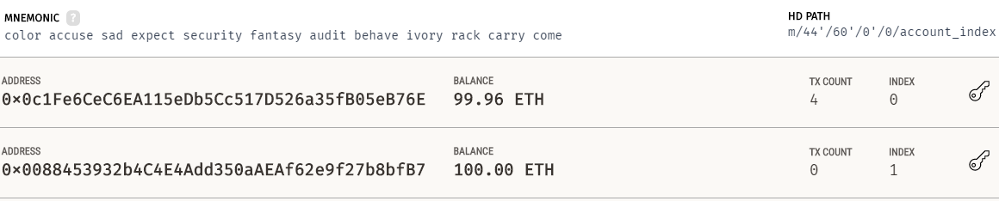
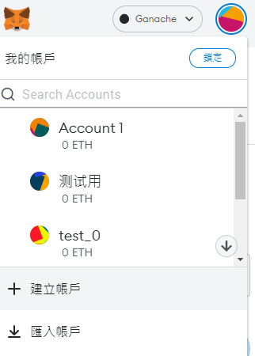

# 0 NewTokenFarm


原始视频地址：https://www.bilibili.com/video/BV1744y1P7TC?spm_id_from=333.1007.top_right_bar_window_custom_collection.content.click

代码成品: https://github.com/dappuniversity/defi_tutorial


## 0.0 技术栈:

1. Truffle: https://trufflesuite.com/
2. React: https://reactjs.org/
3. Vite: https://vitejs.dev/
4. Ganache: https://trufflesuite.com/ganache/
5. Metamask:https://metamask.io/


***

# 1 初始化


## 1.0 下载原始代码

``` bash
git clone -b starter-code https://github.com/dappuniversity/defi_tutorial NewTokenFarm
```


## 1.1 将项目改为Vite

### 1.1.0 安装依赖

如果安装速度较慢，可以使用cnpm安装。

``` bash
npm i vite --save -dev

npm i vite-plugin-html --save -dev
一个用于处理html的vite插件,类似于webpack-html-plugin

npm i vite-plugin -compression
用于代码压缩

npm i vite-plugin-imagemin --save -dev
用于图片压缩

npm i @vitejs/plugin-react --save -dev
类似于react-loader
```


### 1.1.1 配置文件

按照 vite 官方 react-ts 模板配置如下

添加 vite.config.ts

``` tsx
import { defineConfig } from 'vite'
import react from '@vitejs/plugin-react'

// https://vitejs.dev/config/
export default defineConfig({
  esbuild: {
    jsxFactory: 'h',
    jsxFragment: 'Fragment',
    jsxInject: `import React from 'react'`,
  },
  plugins: [react()]
})

```


### 1.1.2 添加 tsconfig.node.json

``` json
{
  "compilerOptions": {
    "composite": true,
    "module": "es2015",
    "moduleResolution": "node"
  },
  "include": ["vite.config.ts"],
  "exclude": []
}
```


### 1.1.3 添加 tsconfig.json

``` json
{
  "compilerOptions": {
    "target": "ES2015",
    "useDefineForClassFields": true,
    "lib": ["DOM", "DOM.Iterable", "ESNext"],
    "allowJs": false,
    "skipLibCheck": true,
    "esModuleInterop": false,
    "allowSyntheticDefaultImports": true,
    "strict": true,
    "forceConsistentCasingInFileNames": true,
    "module": "ES2015",
    "moduleResolution": "Node",
    "resolveJsonModule": true,
    "isolatedModules": true,
    "noEmit": true,
    "jsx": "react-jsx"
  },
  "include": ["src"]
}
```


### 1.1.4 配置package.json 

添加 devDependencies 与 scripts 如下

``` json
"devDependencies": {
    "@types/react": "^18.0.0",
    "@types/react-dom": "^18.0.0",
    "@vitejs/plugin-react": "^1.3.0",
    "react": "^16.14.0",
    "typescript": "^4.6.3",
    "vite": "^2.9.9"
  },
"scripts": {
    "dev": "vite",
    "build": "tsc && vite build",
    "preview": "vite preview",
    "lint": "vite lint"
  },
```


### 1.1.5 安装依赖

终端输入npm i 安装所有的依赖


## 1.2 更换模板

### 1.2.0 入口文件

修改 入口 src/index.js 文件改名为 main.tsx 配置如下

``` tsx
import React from 'react';
import ReactDOM from 'react-dom';
import 'bootstrap/dist/css/bootstrap.css'
import App from './components/App';

ReactDOM.render(<App />, document.getElementById('root'));
```


### 1.2.1 组件

src/app.tsx

``` tsx
import React, { Component } from 'react'
import Navbar from './Navbar'
import './App.css'

type StateType={
  account:string;
}

type propType={
  [propName:string]:any; 
}

interface App{
  state : StateType;
  props: propType
}

class App extends Component {

  constructor(props:any) {
    super(props)
    this.state = {
      account: '0x0'
    }
  }

  render() {
    return (
      <div>
        <Navbar account={this.state.account} />
        <div className="container-fluid mt-5">
          <div className="row">
            <main role="main" className="col-lg-12 ml-auto mr-auto" style={{ maxWidth: '600px' }}>
              <div className="content mr-auto ml-auto">
                <a
                  href="http://www.dappuniversity.com/bootcamp"
                  target="_blank"
                  rel="noopener noreferrer"
                >
                </a>

                <h1>Hello, World!</h1>

              </div>
            </main>
          </div>
        </div>
      </div>
    );
  }
}

export default App;
```

src/Navbar.tsx

``` tsx
import React, { Component } from 'react'
import farmer from '../farmer.png'

type StateType={
}

type propType={
  account:string;
  [propName:string]:any; 
}

interface Navbar{
  state : StateType;
  props: propType
}

class Navbar extends Component {

  render() {
    return (
      <nav className="navbar navbar-dark fixed-top bg-dark flex-md-nowrap p-0 shadow">
        <a
          className="navbar-brand col-sm-3 col-md-2 mr-0"
          href="http://www.dappuniversity.com/bootcamp"
          target="_blank"
          rel="noopener noreferrer"
        >
          
          &nbsp; DApp Token Farm
        </a>

        <ul className="navbar-nav px-3">
          <li className="nav-item text-nowrap d-none d-sm-none d-sm-block">
            <small className="text-secondary">
              <small id="account">{this.props.account}</small>
            </small>
          </li>
        </ul>
      </nav>
    );
  }
}

export default Navbar;
```


Navbar中存在图片引入错误


在 src 中创建 image.d.ts 配置如下

``` tsx
/*
  ts图片声明导入
*/ 

declare module '*.svg'
declare module '*.png'
declare module '*.jpg'
declare module '*.jpeg'
declare module '*.gif'
declare module '*.bmp'
declare module '*.tiff'
```


在public 中添加常用工具 babel.min.js 用来解析语法文件


最后把index.html 从 public 目录移到项目根目录(即移到public外)

配置如下

``` html
<!DOCTYPE html>
<html lang="en">
  <head>
    <meta charset="utf-8" />
    <link rel="shortcut icon" href="/favicon.ico" />
    <meta
      name="viewport"
      content="width=device-width, initial-scale=1, shrink-to-fit=no"
    />
    <meta name="theme-color" content="#000000" />
    <!--
...
    -->
    <link rel="manifest" href="/manifest.json" />
    <script src="/babel.min.js"></script>
    <!--
...
    -->
    <title>Dapp Token Farm</title>
  </head>
  <body>
    <noscript>You need to enable JavaScript to run this app.</noscript>
    <div id="root"></div>
    <!--
...
    -->
    <script type="module" src="./src/main.tsx"></script>
  </body>
</html>

```


### 1.2.3 更换完成

在终端中输入

``` bash
npm run dev
```

即可完成前端的部署

网页效果如下


***

# 2 区块链开发

## 2.0 区块链项目初始化


### 2.0.0 项目解析

我们开发的Dapp 是需要用户把代币(mDai Token) 质押到我们的Dapp(TokenFarm)，然后我们发送空投代币(Dapp Token)作为奖励给到用户

我们使用 Ganache 与 truffle 来进行开发与测试


### 2.0.1 Migrations

Migrations 是 truffle 实现快速部署新合约的配置合约

``` bash
truffle migrate
即可快速更新合约
```


## 2.1 初尝试

我们已经在contracts 中有 两个erc20(标准代币合约) 的文件，各有1000000*10^18 wei，如果看不懂请自行谷歌一下，在这里不详细解析


### 2.1.0 创建TokenFarm合约

我们在 src/contracts 创建一个solidity 合约文件 TokenFarm.sol 如下

``` solidity
pragma solidity ^0.5.0;

contract TokenFarm {
	
  string public name = "Dapp Token Farm";
}
```


### 2.1.1 配置部署文件

然后在 migrations 中添加合约部署文件 2_deploy_contracts.js 如下

``` js
const TokenFarm = artifacts.require("TokenFarm");
const DappToken = artifacts.require("DappToken");
const DaiToken = artifacts.require("DaiToken");

module.exports =async function(deployer,network,accounts) {
  // 部署合约
  await deployer.deploy(DaiToken)
  const daiToken = await DaiToken.deployed()
  await deployer.deploy(DappToken)
  const dappToken = await DappToken.deployed()


  await deployer.deploy(TokenFarm)
  const tokenFarm = await TokenFarm.deployed()
};
```


### 2.1.2 创建测试文件

根目录下创建文件 test 文件夹 

test 文件夹创建文件 TokenFarm.test.js

用作测试文件

``` js
const { assert } = require('chai');

const TokenFarm = artifacts.require("TokenFarm");
const DappToken = artifacts.require("DappToken");
const DaiToken = artifacts.require("DaiToken");

require('chai').use(require('chai-as-promised')).should()
```


### 2.1.3 Ganache 部署

然后打开 Ganache 点 QuickStart 快速部署一条区块链

配置 Ganache 端口与 truffle.config.js 保持一致(均为7545)


### 2.1.4 合约部署

0. 终端输入 ``` truffle compile ``` 编译合约文件生成 uri

1. 终端输入 ``` truffle migrate ``` 即可部署合约到区块链中

出现一堆代码，还有Ganache 多出几条交易




我们看到下面这条表示部署成功了


### 2.1.5 测试

继续编写测试代码 truffle.config.js 如下

``` js
contract('TokenFarm', ([owner, investor]) => {
  let daiToken, dappToken, tokenFarm

  before(async ()=>{
    // 加载合约
    daiToken = await DaiToken.new()
    dappToken = await DappToken.new()
    tokenFarm = await TokenFarm.new()

    // 把所有的代币发送给tokenFarm
    await dappToken.transfer(tokenFarm.address, tokens('1000000'))

    // 发送100 给代币到用户
    await daiToken.transfer(investor, tokens('100'), { from: owner })
  })

  // 测试 daiToken 合约 name 属性 返回值是否为 'Mock DAI Token'
  describe('Mock Dai deployment', async ()=>{
    it('has a name', async ()=>{
      const name = await daiToken.name()
      assert.equal(name,'Mock DAI Token')
    })
  })

  // 测试 DappToken 合约 name 属性 返回值是否为 'Dapp Token'
  describe('peiqi', async ()=>{
    it('has a name', async ()=>{
      const name = await daiToken.name() // error
      assert.equal(name,'Dapp Token')
    })
  })
  }
)
```

然后终端输入 truffle test 测试

结果如下

'Mock Dai deployment' 测试成功

'peiqi' 测试失败了(因为 dappToken.name() 改成了 daiToken.name() )


最终代码改成如下

``` js
const { assert } = require('chai');

const TokenFarm = artifacts.require("TokenFarm");
const DappToken = artifacts.require("DappToken");
const DaiToken = artifacts.require("DaiToken");

require('chai').use(require('chai-as-promised')).should()

contract('TokenFarm', ([owner, investor]) => {
  let daiToken, dappToken, tokenFarm

  before(async ()=>{
    // 加载合约
    daiToken = await DaiToken.new()
    dappToken = await DappToken.new()
    tokenFarm = await TokenFarm.new()

    // 把所有的代币发送给tokenFarm
    await dappToken.transfer(tokenFarm.address, tokens('1000000'))

    // 发送100 给代币到用户
    await daiToken.transfer(investor, tokens('100'), { from: owner })
  })

  // 测试 daiToken 合约 name 属性 返回值是否为 'Mock DAI Token'
  describe('Mock Dai deployment', async ()=>{
    it('has a name', async ()=>{
      const name = await daiToken.name()
      assert.equal(name,'Mock DAI Token')
    })
  })

  // 测试 DappToken 合约 name 属性 返回值是否为 'Dapp Token'
  describe('Dapp Token deployment', async ()=>{
    it('has a name', async ()=>{
      const name = await dappToken.name() // 已更正
      assert.equal(name,'DApp Token')
    })
  })
  }
)
```


终端输入``` truffle test ``` 测试结果如下


两个测试都打钩成功通过了


***


## 2.2 构造函数


### 2.2.0 添加合约属性

修改 TokenFarm.sol 合约

``` solidity
pragma solidity ^0.5.0;

import "./DappToken.sol";
import "./DaiToken.sol";

contract TokenFarm {

  string public name = "Dapp Token Farm";
  DappToken public dappToken; // 合约 A
  DaiToken public daiToken; // 合约 B
  address public owner; // 合约拥有着

  // 构造函数 仅在代码部署的时候执行一次，部署完成无法再执行
  constructor(DappToken _dappToken, DaiToken _daiToken) public {
    dappToken = _dappToken; // 保存合约
    daiToken = _daiToken; // 保存合约
    owner = msg.sender; // 部署合约的时候记录交易发送者(即为拥有者)
    // 该用户在合约中有一定的权限
  }
}
```


### 2.2.1 修改部署参数

修改 migrations/2_deploy_contracts.js 

``` js
const TokenFarm = artifacts.require("TokenFarm");
const DappToken = artifacts.require("DappToken");
const DaiToken = artifacts.require("DaiToken");

module.exports =async function(deployer,network,accounts) {
  await deployer.deploy(DaiToken)
  const daiToken = await DaiToken.deployed()
  await deployer.deploy(DappToken)
  const dappToken = await DappToken.deployed()

  // 按照合约参数顺序dappToken.address,daiToken.address (传入构造函数需要的参数要放在 TokenFarm 后面)
  await deployer.deploy(TokenFarm,dappToken.address,daiToken.address)
  const tokenFarm = await TokenFarm.deployed()

  // 发送 1000000 个 dappToken 给 TokenFarm
  await dappToken.transfer(tokenFarm.address,'1000000000000000000000000')
  
  // 发送 100 个 DAI 给 账号1(用户)
  await daiToken.transfer(accounts[1],'100000000000000000000')
};
```

注意这个accounts 为 Ganache 的地址列表

account[1] 为如下index1 账号 0x33e8......4f9d


### 2.2.2 测试

在测试中添加一个 ether -> wei 转换函数

1 ether === 10^18 wei

``` js
function tokens(n) {
  // 用作数值转换 100 ether => 1*10^20 wei
  // 1ether = 10^18
  return web3.utils.toWei(n, 'Ether')
}
```

最终代码如下

注意 Token 部署合约中添加了地址参数

``` js
  const { assert } = require('chai');

  const TokenFarm = artifacts.require("TokenFarm");
  const DappToken = artifacts.require("DappToken");
  const DaiToken = artifacts.require("DaiToken");

  require('chai').use(require('chai-as-promised')).should()

  function tokens(n) {
    // 用作数值转换 100 ether => 1*10^20 wei
    // 1ether = 10^18
    return web3.utils.toWei(n, 'Ether')
  }

  contract('TokenFarm', ([owner, investor]) => {
    let daiToken, dappToken, tokenFarm

    before(async ()=>{
      // 加载合约
      daiToken = await DaiToken.new()
      dappToken = await DappToken.new()
      tokenFarm = await TokenFarm.new(dappToken.address,daiToken.address)

      // 把所有的代币发送给tokenFarm
      await dappToken.transfer(tokenFarm.address, tokens('1000000'))

      // 发送100 给代币到用户
      await daiToken.transfer(investor, tokens('100'), { from: owner })
    })

    // 测试 daiToken 合约 name 属性 返回值是否为 'Mock DAI Token'
    describe('Mock Dai deployment', async ()=>{
      it('has a name', async ()=>{
        const name = await daiToken.name()
        assert.equal(name,'Mock DAI Token')
      })
    })

    // 测试 DappToken 合约 name 属性 返回值是否为 'Dapp Token'
    describe('Dapp Token deployment', async ()=>{
      it('has a name', async ()=>{
        const name = await dappToken.name()
        assert.equal(name,'DApp Token')
      })
    })

    // 测试 DappToken 合约 name 属性 返回值是否为 'Dapp Token Farm'
    describe('Token Farm deployment', async () => {
      it('has a name', async () => {
        const name = await tokenFarm.name()
        assert.equal(name, 'Dapp Token Farm')
      })

      // 测试tokenFarm 地址 是否有1000000*10^18 个 dappToken
      it('contract has tokens', async () => {
        let balance = await dappToken.balanceOf(tokenFarm.address)
        assert.equal(balance.toString(), tokens('1000000'))
      })
    })
    }
  )
```


终端输入

``` bash
truffle migrate 
// 迁移合约
truffle test
// 测试
```

如下测试成功


## 2.3 质押代币


### 2.3.0 编写合约

继续编写 TokenFarm.sol 合约

如下添加质押代币所需的属性及属性及函数 stakeTokens()

``` solidity
pragma solidity ^0.5.0;

import "./DappToken.sol";
import "./DaiToken.sol";

contract TokenFarm {

  string public name = "Dapp Token Farm";
  DappToken public dappToken; // 合约 A
  DaiToken public daiToken; // 合约 B
  address public owner; // 合约拥有者

  address[] public stackers; // 质押过的名单(用于空投代币)
  mapping(address => uint256) public stakingBalance; // 正在质押总量
  mapping(address => bool) public hasStaked; // 已经质押过的地址
  mapping(address => bool) public isStaking; // 正在质押的地址

  // 构造函数 仅在代码部署的时候执行一次，部署完成无法再执行
  constructor(DappToken _dappToken, DaiToken _daiToken) public {
    dappToken = _dappToken; // 保存合约
    daiToken = _daiToken; // 保存合约
    owner = msg.sender; // 部署合约的时候设定拥有者
    // 该用户在合约中有一定的权限
  }

  // 1.质押代币
  function stakeTokens(uint _amount) public {
    // 要求质押的代币大于0
    require(_amount > 0,"amount cannot be 0");

    daiToken.transferFrom(msg.sender, address(this), _amount);
    // 更新质押数量
    stakingBalance[msg.sender] += _amount;

    // 更新已经质押过的名单
    if(!hasStaked[msg.sender]){
      stackers.push(msg.sender);
    }

    // 更新是否正在质押
    hasStaked[msg.sender] = true;
    isStaking[msg.sender] = true;
  }
}
```


### 2.3.1 编写测试

TokenFarm.test.js 添加如屑测试代码

``` js
// ... 省略代码

    describe("Farming tokens",async()=>{
      it('rewards investors for staking mDai tokens', async () => {
        let result
  
        // 检查用户是否有100个 DAI
        result = await daiToken.balanceOf(investor)
        assert.equal(result.toString(), tokens('100'), 'investor mDAI wallet balance correst before staking')
  
        // 用户授权100个 DAI，并质押到 TokenFarm
        await daiToken.approve(tokenFarm.address, tokens('100'), { from: investor })
        await tokenFarm.stakeTokens(tokens('100'), { from: investor })
  
        // 查询用户 DAI 余额是否为0
        result = await daiToken.balanceOf(investor)
        assert.equal(result.toString(), tokens('0'), 'investor mDAI wallet balance correst before staking')
  
        // 检查 TokenFarm 地址是否有100个 DAI
        result = await daiToken.balanceOf(tokenFarm.address)
        assert.equal(result.toString(), tokens('100'), 'TokenFarm mDAI wallet balance correst before staking')
  
        // 检查用户是否在 TokenFarm 质押 100 个 DAI
        result = await tokenFarm.stakingBalance(investor)
        assert.equal(result.toString(), tokens('100'), 'investor staking balance correst after staking')
  
        // 检查用户是否在质押
        result = await tokenFarm.isStaking(investor)
        assert.equal(result.toString(), 'true', 'investor staking status correst after staking')
      })
    })
```


### 2.3.2 测试

继续在终端修改，并测试

``` bash
truffle migrate
truffle test
```

如下大成功！！！！！！！！！！！


## 2.4 空投代币


### 2.4.0 编写合约

给TokenFarm.sol 添加如下空投函数

``` solidity
  // 3.空投代币
  function issueTokens() public {
    // 要求必须为合约拥有者才能空投代币
    require(msg.sender == owner, "caller must be the owner");

    // 给所有质押过的用户空投
    for (uint256 i = 0; i < stackers.length; i++) {
      address recipient = stackers[i];
      uint balance = stakingBalance[recipient];
      if (balance > 0){
        dappToken.transfer(recipient, balance);
      }
    }
  }
```


### 2.4.1 编写测试

继续编写，测试添加如下代码

``` js
        // 空投代币
        await tokenFarm.issueTokens({ from: owner })

        // 检查用户余额
        result = await dappToken.balanceOf(investor)
        assert.equal(result.toString(), tokens('100'), 'investor Dapp Tokens balance correst after staking')

        // 确保只有拥有者能调用空投函数
        await tokenFarm.issueTokens({ from: investor }).should.be.rejected;
```


### 2.4.2 测试

继续在终端修改，并测试

``` bash
truffle migrate
truffle test
```

如下再度大成功！！！！！！！！！！！


### 2.5.3 封装空投代币函数

在根目录创建一个 scripts 文件夹在里面创建一个 issue-token.js

``` js
const TokenFarm = artifacts.require('TokenFarm')

module.exports =async function(callback) {

  let tokenFarm = await TokenFarm.deployed()
  await tokenFarm.issueTokens()
  
  console.log("Tokens issued!")
  callback()
};
```

继续在终端修改，获取uri，并测试

``` bash
truffle compile 
truffle migrate
truffle test
truffle exec scripts/issue-token.js
```

如下成功空投


## 2.5 取出代币(最终代码)


### 2.5.0 编写合约

TokenFarm 添加如下函数

``` solidity
pragma solidity ^0.5.0;

import "./DappToken.sol";
import "./DaiToken.sol";

contract TokenFarm {

  string public name = "Dapp Token Farm";
  DappToken public dappToken; // 合约 A
  DaiToken public daiToken; // 合约 B
  address public owner; // 合约拥有者

  address[] public stackers; // 质押过的名单(用于空投代币)
  mapping(address => uint256) public stakingBalance; // 正在质押总量
  mapping(address => bool) public hasStaked; // 已经质押过的地址
  mapping(address => bool) public isStaking; // 正在质押的地址

  // 构造函数 仅在代码部署的时候执行一次，部署完成无法再执行
  constructor(DappToken _dappToken, DaiToken _daiToken) public {
    dappToken = _dappToken; // 保存合约
    daiToken = _daiToken; // 保存合约
    owner = msg.sender; // 部署合约的时候设定拥有者
    // 该用户在合约中有一定的权限
  }

  // 1.质押代币
  function stakeTokens(uint _amount) public {
    // 要求质押的代币大于0
    require(_amount > 0,"amount cannot be 0");

    daiToken.transferFrom(msg.sender, address(this), _amount);
    // 更新质押数量
    stakingBalance[msg.sender] += _amount;

    // 更新已经质押过的名单
    if(!hasStaked[msg.sender]){
      stackers.push(msg.sender);
    }

    // 更新是否正在质押
    hasStaked[msg.sender] = true;
    isStaking[msg.sender] = true;
  }

  // 2.取出质押的代币
  function unstakeTokens() public {
    // 获取正在质押的总数
    uint balance = stakingBalance[msg.sender];

    // 要求正在质押总量大于0
    require(balance > 0, "staking banlance cannot be 0");

    // 将 DAI 发送回用户地址
    daiToken.transfer(msg.sender,balance);

    // 更新用户设置质押数量
    stakingBalance[msg.sender] = 0;

    // 更新用户质押状态
    isStaking[msg.sender] = false;
  }

  // 3.空投代币
  function issueTokens() public {
    // 要求必须为合约拥有者才能空投代币
    require(msg.sender == owner, "caller must be the owner");

    // 给所有质押过的用户空投
    for (uint256 i = 0; i < stackers.length; i++) {
      address recipient = stackers[i];
      uint balance = stakingBalance[recipient];
      if (balance > 0){
        dappToken.transfer(recipient, balance);
      }
    }
  }
}
```


### 2.5.1 编写测试

添加 取出质押代币的测试

``` js
const { assert } = require('chai');

const TokenFarm = artifacts.require("TokenFarm");
const DappToken = artifacts.require("DappToken");
const DaiToken = artifacts.require("DaiToken");

require('chai').use(require('chai-as-promised')).should()

function tokens(n) {
  // 用作数值转换 100 ether => 1*10^20 wei
  // 1ether = 10^18
  return web3.utils.toWei(n, 'Ether')
}

contract('TokenFarm', ([owner, investor]) => {
  let daiToken, dappToken, tokenFarm

  before(async () => {
    // 加载合约
    daiToken = await DaiToken.new()
    dappToken = await DappToken.new()
    tokenFarm = await TokenFarm.new(dappToken.address, daiToken.address)

    // 把所有的代币发送给tokenFarm
    await dappToken.transfer(tokenFarm.address, tokens('1000000'))

    // 发送100 给代币到用户
    await daiToken.transfer(investor, tokens('100'), { from: owner })
  })

  // 测试 daiToken 合约 name 属性 返回值是否为 'Mock DAI Token'
  describe('Mock Dai deployment', async () => {
    it('has a name', async () => {
      const name = await daiToken.name()
      assert.equal(name, 'Mock DAI Token')
    })
  })

  // 测试 DappToken 合约 name 属性 返回值是否为 'Dapp Token'
  describe('Dapp Token deployment', async () => {
    it('has a name', async () => {
      const name = await dappToken.name()
      assert.equal(name, 'DApp Token')
    })
  })

  // 测试 DappToken 合约 name 属性 返回值是否为 'Dapp Token Farm'
  describe('Token Farm deployment', async () => {
    it('has a name', async () => {
      const name = await tokenFarm.name()
      assert.equal(name, 'Dapp Token Farm')
    })

    // 测试tokenFarm 地址 是否有1000000*10^18 个 dappToken
    it('contract has tokens', async () => {
      let balance = await dappToken.balanceOf(tokenFarm.address)
      assert.equal(balance.toString(), tokens('1000000'))
    })
  })

  describe("Farming tokens", async () => {
    it('rewards investors for staking mDai tokens', async () => {
      let result

      // 检查用户是否有100个 DAI
      result = await daiToken.balanceOf(investor)
      assert.equal(result.toString(), tokens('100'), 'investor mDAI wallet balance correst before staking')

      // 用户授权100个 DAI，并质押到 TokenFarm
      await daiToken.approve(tokenFarm.address, tokens('100'), { from: investor })
      await tokenFarm.stakeTokens(tokens('100'), { from: investor })

      // 查询用户 DAI 余额是否为0
      result = await daiToken.balanceOf(investor)
      assert.equal(result.toString(), tokens('0'), 'investor mDAI wallet balance correst before staking')

      // 检查 TokenFarm 地址是否有100个 DAI
      result = await daiToken.balanceOf(tokenFarm.address)
      assert.equal(result.toString(), tokens('100'), 'TokenFarm mDAI wallet balance correst before staking')

      // 检查用户是否在 TokenFarm 质押 100 个 DAI
      result = await tokenFarm.stakingBalance(investor)
      assert.equal(result.toString(), tokens('100'), 'investor staking balance correst after staking')

      // 检查用户是否在质押
      result = await tokenFarm.isStaking(investor)
      assert.equal(result.toString(), 'true', 'investor staking status correst after staking')

      // 空投代币
      await tokenFarm.issueTokens({ from: owner })

      // 检查用户余额
      result = await dappToken.balanceOf(investor)
      assert.equal(result.toString(), tokens('100'), 'investor Dapp Tokens balance correst after staking')

      // 确保只有拥有者能调用空投函数
      await tokenFarm.issueTokens({ from: investor }).should.be.rejected;

      // 取出质押的代币 DAI
      await tokenFarm.unstakeTokens({ from: investor })

      // 检查用户 DAI 余额
      result = await daiToken.balanceOf(investor)
      assert.equal(result.toString(), tokens('100'), 'investor Mock Dai balance correst after staking')

      // 检查 TokenFarm 地址的 DAI 余额
      result = await daiToken.balanceOf(tokenFarm.address)
      assert.equal(result.toString(), tokens('0'), 'tokenFarm Mock Dai balance correst after staking')

      // 检查用户正在质押的DAI 余额
      result = await tokenFarm.stakingBalance(investor)
      assert.equal(result.toString(), tokens('0'), 'tokenFarm Mock Dai balance correst after staking')

      // 检查用户是否正在质押
      result = await tokenFarm.isStaking(investor)
      assert.equal(result.toString(), "false", 'tokenFarm status correst after staking')
    })
  })
})
```


### 2.5.2 测试

继续在终端修改，并测试

``` bash
truffle migrate
truffle test
```

成功，我们的合约完成了


***

# 3 前端页面开发


## 3.1 配置数据接口

app.tsx

``` tsx
import React, { Component } from 'react'
import Navbar from './Navbar'
import './App.css'

// tsx 数据接口写法
type StateType = {
  account: string,
  daiToken: object,
  dappToken: object,
  tokenFarm: object,
  daiTokenBalance: string,
  dappTokenBalance: string,
  stakingBalance: string,
  loading: boolean,
}

type propType = {
  [propName: string]: any,
}

interface App {
  state: StateType,
  props: propType
}

class App extends Component {

  constructor(props: any) {
    super(props)
    this.state = {
      account: '0x0',
      daiToken: {},
      dappToken: {},
      tokenFarm: {},
      daiTokenBalance: '0',
      dappTokenBalance: '0',
      stakingBalance: '0',
      loading: true,
    }
  }

  render() {
    return (
      <div>
        <Navbar account={this.state.account} />
        <div className="container-fluid mt-5">
          <div className="row">
            <main role="main" className="col-lg-12 ml-auto mr-auto" style={{ maxWidth: '600px' }}>
              <div className="content mr-auto ml-auto">
                <a
                  href="http://www.dappuniversity.com/bootcamp"
                  target="_blank"
                  rel="noopener noreferrer"
                >
                </a>

                <h1>Hello, World!</h1>

              </div>
            </main>
          </div>
        </div>
      </div>
    );
  }
}

export default App;

```

Navbar.tsx

``` tsx
import React, { Component } from 'react'
import farmer from '../farmer.png'

type StateType={
}

type propType={
  account:string;
  [propName:string]:any; 
}

interface Navbar{
  state : StateType;
  props: propType
}

class Navbar extends Component {

  render() {
    return (
      <nav className="navbar navbar-dark fixed-top bg-dark flex-md-nowrap p-0 shadow">
        <a
          className="navbar-brand col-sm-3 col-md-2 mr-0"
          href="http://www.dappuniversity.com/bootcamp"
          target="_blank"
          rel="noopener noreferrer"
        >
          
          &nbsp; DApp Token Farm
        </a>

        <ul className="navbar-nav px-3">
          <li className="nav-item text-nowrap d-none d-sm-none d-sm-block">
            <small className="text-secondary">
              <small id="account">{this.props.account}</small>
            </small>
          </li>
        </ul>
      </nav>
    );
  }
}

export default Navbar;

```


## 3.2 页面加载数据获取

在定义web3 时出现ts语法错误，尽管编译后仍然有效但红色的波浪线还是很让人不爽。


解决办法声明一个 typing.d.ts文件，内容如下(ts编译器会认为 *.d.ts 文件是类型声明文件)

``` typescript
declare interface Window{
  web3:any
}
```


## 3.3 Vite使用web3报错

因为 web3 在 其他 环境中（比如 [webpack](https://so.csdn.net/so/search?q=webpack&spm=1001.2101.3001.7020), @vue/cli）运行，它们本身会下载一些依赖包，而 vite将不需要的包删除了，所以它没有 Buffer global 或者 process.env(xxx is not defined)的错误。

因此在vite中web3 引入要改成如下

``` ts
import Web3 from 'web3/dist/web3.min.js'
```

同时在src/types 文件夹中创建一个 index.d.ts中创建一个文件夹用来定义模块和接口。

``` typescript
declare module 'web3/dist/web3.min.js'

declare interface Window{
  web3:any;
  ethereum:any;
}
```


## 3.4 abi的any索引错误

如下所示在使用abi数据时产生的


解决方法

只需要在 tsconfig.json 的 "compilerOptions" 中添加如下

``` json
...
	"suppressImplicitAnyIndexErrors": true
...
```


## 3.5 实现数据展示

App.tsx

``` tsx
import React, { Component } from 'react'
import TF from './TF'
import Navbar from './Navbar'
import './App.css'
import Web3 from 'web3/dist/web3.min.js'
import DaiToken from '../abis/DaiToken.json'
import DappToken from '../abis/DappToken.json'
import TokenFarm from '../abis/TokenFarm.json'

// tsx 数据接口写法
type StateType = {
  account: string;
  daiToken: object;
  dappToken: object;
  tokenFarm: object;
  daiTokenBalance: string;
  dappTokenBalance: string;
  stakingBalance: string;
  loading: boolean;
}

type propType = {
  [propName: string]: any;
}

interface App {
  state: StateType;
  props: propType;
}

interface Window {
  web3: object;
}

class App extends Component {

  constructor(props: any) {
    super(props)
    this.state = {
      account: '0x0',
      daiToken: {},
      dappToken: {},
      tokenFarm: {},
      daiTokenBalance: '0',
      dappTokenBalance: '0',
      stakingBalance: '0',
      loading: true
    }
  }

  async componentDidMount() {
    await this.loadWeb3()
    await this.loadBlockChainData()
  }

  async loadWeb3() {
    if (window.ethereum) {
      window.web3 = new Web3(window.ethereum)
      await window.ethereum.enable()
    }
    else if (window.web3) {
      window.web3 = new Web3(window.web3.currentProvider)
    }
    else {
      window.alert('Non')
    }
  }

  // 加载区块链数据
  async loadBlockChainData() {
    // 获取账户
    const web3 = window.web3
    const accounts = await web3.eth.getAccounts()
    this.setState({ account: accounts[0] })

    const networkId = await web3.eth.net.getId()

    // 获取DaiToken合约数据
    const daiTokenData = DaiToken.networks[networkId]
    if (daiTokenData) {
      const daiToken = new web3.eth.Contract(DaiToken.abi, daiTokenData.address)
      this.setState({ daiToken })
      // 获取用户DaiToken的余额
      let daiTokenBalance = await daiToken.methods.balanceOf(this.state.account).call()
      this.setState({ daiTokenBalance: daiTokenBalance.toString() })
    } else {
      window.alert('DaiToken contract no deployed to detected network')
    }

    // 获取DappToken合约数据
    const dappTokenData = DappToken.networks[networkId]
    if (dappTokenData) {
      const dappToken = new web3.eth.Contract(DappToken.abi, dappTokenData.address)
      this.setState({ dappToken })
      // 用户DappToken的余额
      let dappTokenBalance = await dappToken.methods.balanceOf(this.state.account).call()
      this.setState({ dappTokenBalance: dappTokenBalance.toString() })
    } else {
      window.alert('DappToken contract no deployed to detected network')
    }

    // 获取TokenFarm合约数据
    const tokenFarmData = TokenFarm.networks[networkId]
    if (tokenFarmData) {
      const tokenFarm = new web3.eth.Contract(TokenFarm.abi, tokenFarmData.address)
      this.setState({ tokenFarm })
      // 获取用户质押数据
      let stakingBalance = await tokenFarm.methods.stakingBalance(this.state.account).call()
      this.setState({ stakingBalance: stakingBalance.toString() })
    } else {
      window.alert('TokenFarm contract no deployed to detected network')
    }

    // 加载完成
    this.setState({ loading: false })
  }

  render() {
    let content
    if (this.state.loading) {
      // 显示正在加载
      content = <p id='loader' className='text-center'></p>
    } else {
      content = <TF
        daiTokenBalance={this.state.daiTokenBalance}
        dappTokenBalance={this.state.dappTokenBalance}
        stakingBalance={this.state.stakingBalance}
      ></TF>
    }
    return (
      <div>
        <Navbar account={this.state.account} />
        <div className="container-fluid mt-5">
          <div className="row">
            <main role="main" className="col-lg-12 ml-auto mr-auto" style={{ maxWidth: '600px' }}>
              <div className="content mr-auto ml-auto">
                <a
                  href="http://www.dappuniversity.com/bootcamp"
                  target="_blank"
                  rel="noopener noreferrer"
                >
                </a>

                {content}

              </div>
            </main>
          </div>
        </div>
      </div>
    );
  }
}

export default App;

```

TF.tsx

``` tsx
import React, { Component } from 'react'

// tsx 数据接口写法
type StateType = {
}

type propType = {
  daiTokenBalance:string;
  dappTokenBalance:string;
  stakingBalance:string;
}

interface TF {
  state: StateType;
  props: propType;
}

class TF extends Component {
  render() {
    return (
      <div id="content" className='mt-3'>
        <table className='table table-borderless text-muted text-center'>
          <thead>
            <tr>
              <th scope='col'>Staking Balance</th>
              <th scope='col'>Reward Balance</th>
            </tr>
          </thead>
          <tbody>
            {/* 展示余额 */}
            <tr>
              <td>{window.web3.utils.fromWei(this.props.stakingBalance,'Ether')} mDai</td>
              <td>{window.web3.utils.fromWei(this.props.dappTokenBalance,'Ether')} DAPP</td>
            </tr>
          </tbody>
        </table>
      </div>
    )
  }
}

export default TF
```


## 3.6 配置钱包

这时候找到Ganache index1的钱包私钥导入到小狐狸钱包中

如下点击汇入账户即可加载测试账户。




然后上方选择网络中，点击新增网络。


点击左侧的进阶


打开show test networks


然后再次点击左侧的网络


再点击右上角的 add a network

然后按照如下配置保存即可


最后切换到刚配置好的Ganache网络，如果有100个ETH就表示我们成功了(千万不要当真)。


## 3.7 编写质押请求


## 3.8 最终效果

现在账户(用户)上有100个DAI


全质押上


第一个交易是发送mDAI许可


第二个交易才是质押


交易完成后刷新页面

可以看到已经有100个代币正在质押


打开终端 

输入已经准备好的 ``` truffle exec scripts/issue-token.js ``` 发放空投

刷新页面

成功收到空投


点击 UN-STAKE 取出质押的 DdiToken，发送交易

成功取出


我们的Dapp TokenFarm 已经完成了，让它上线割韭菜把，然后等着代币进各大交易所就行了(哈哈)。
